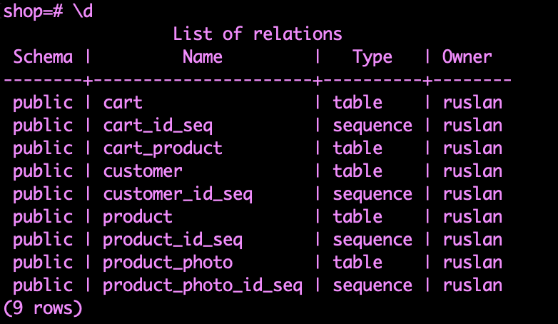
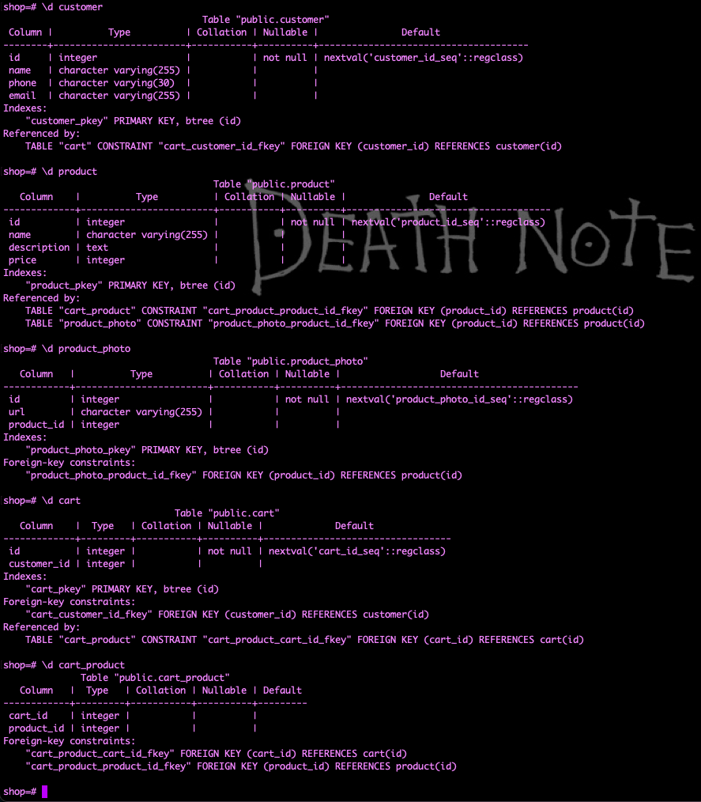
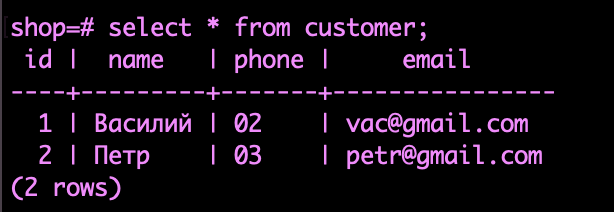
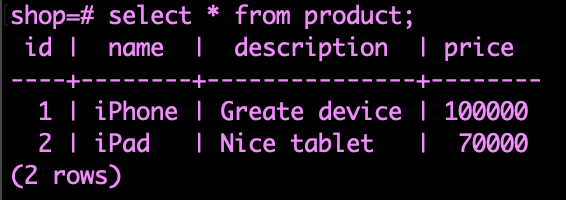

## Базы данных

#### **Нормальная форма**

1. Ячейка бд должна содержать 1 значение
2. Каждая запись должна иметь id

> При написании скриптов в бд, в конце строки всегда нужно ставить ";"

## MYSQL

#### **Посмотреть все базы данных на сервере**

Команда:

`SHOW DATABASES;`

#### **Создание базы данных**

Команда:

`CREATE DATABASE new_database_name;`

Пример:

`CREATE DATABASE school_db;`

#### **Удалить базу данных**

Команда:

`DROP DATABASE database_name;`

Пример:

`DROP DATABASE school_db;`

#### **Использовать определенную бд в сессии**

Команда:

`USE database_name;`

Пример:

`USE school_db;`

#### **Посмотреть таблицы внутри выбранной базы данных**

Команда:

`show tables`

#### **Создать таблицу в выбранной бд**

Команда:

`CREATE TABLE table_name(primary_key INT AUTO_INCREMENT PRIMARY KEY, key_name VARCHAR(255) NOT NULL);`

> Создание колонок в таблице чередуется запятой в круглых скобках.

* **AUTO_INCREMENT** - ключ будет создаваться автоматически самим сервером баз данных
* **PRIMARY KEY** - Первичный ключ каждой сущности - т.е. именно этот ключ будет использоваться как указатель из других табличек
* **NOT NULL** - Значение этой колонки в записи сущности не может быть пустым
* **INT** - тип данных *число*
* **VARCHAR(255)** - тип данных *строка* которое будет состоять из максимум 255 символов

Пример:

`CREATE TABLE teacher(id INT AUTO_INCREMENT PRIMARY KEY, surname VARCHAR(255) NOT NULL);`

#### **Посмотреть какие поля есть в таблице**

Команда:

`show columns FROM table_name;`

Пример:

`show columns FROM teacher;`

#### **Создание таблицы с привязкой к ключу из другой таблицы**

Команда:

`CREATE TABLE table_name(primary_key INT AUTO_INCREMENT PRIMARY KEY, foreign_key INT NOT NULL, FOREIGN KEY (foreign_key) references table_for_link_key(link_key));`

> Связывание ключа объявляется как следующий ключ, через зарятую после ключа который нужно связать.
> Ключ который будет ссылкой должен быть того же типа что и ключ из другой таблицы который будет связан.

* **FOREIGN KEY (foreign_key)** - Говорим что дальше будет объявлен внешний ключ, в скобках пишем ключ из нынешней таблицы который будет указывать на внешний ключ из другой таблицы.
* **references table_for_link_key(link_key)** - Говорим из какой таблицы взять нужный ключ.

Пример:

`CREATE TABLE lesson(id INT AUTO_INCREMENT PRIMARY KEY, name VARCHAR(255) NOT NULL, teacher_id INT NOT NULL, FOREIGN KEY (teacher_id) references teacher(id));`

#### **Вставить сущность в таблицу**

Команда:

`INSERT INTO table_name (key_from_table) values (value_for_key);`

Пример:

`INSERT INTO teacher (surname) values ("Иванов");`

> Ключ AUTO_INCREMENT указывать не нужно, так как он создаться автоматически.

#### **Получить все данные из таблицы**

Команда:

`SELECT * FROM table_name;`

Пример:

`SELECT * FROM teacher;`

#### **Получить определенные поля из таблицы**

Команда:

`SELECT key_name_1, key_name_2 FROM table_name;`

Пример:

`SELECT id, surname FROM teacher;`

#### **Получить уникальные сущности из таблицы по ключу**

Команда:

`SELECT DISTINCT key_name FROM table_name;`

Пример:

`SELECT DISTINCT surname FROM teacher;`

#### **Получить данные по условию**

Команда:

`SELECT * FROM table_name WHERE key_name = "desired_value";`

Пример:

`SELECT * FROM teacher WHERE id = 3;`

> Тут же можно использовать разные условия, например **`id < 3`** или **`id > 2`**

#### **Получить ограниченное количество записей**

Команда:

`SELECT * FROM table_name LIMIT desired_limit_value;`

Пример:

`SELECT * FROM teacher LIMIT 2;`

#### **Получить записи из таблицы с переписанными ключами**

Команда:

`SELECT key_name AS 'desired_key_name', second_key_name AS 'desired_for_second_key_name' FROM table_name;`

Пример:

`SELECT id AS 'unique_id', surname AS 'second_name' FROM teacher;`

#### **Отсортировать записи из таблицы**

Команда:

`SELECT * FROM table_name ORDER BY key_name;`

Пример:

`SELECT * FROM teacher ORDER BY surname;`

> Что бы отсортировать данные в обратном порядке в конце условия нужно прописать ключевое слово `DESC` -> `SELECT * FROM teacher ORDER BY surname DESC;`

#### **Добавить колонку в таблицу**

Команда:

`ALTER TABLE table_name ADD key_name type;`

Пример:

`ALTER TABLE teacher ADD age INT;`

Или

`ALTER TABLE teacher ADD name VARCHAR(255) NOT NUll;`

#### **Обновить запись в таблице**

Команда:

`UPDATE table_name SET key_name = "desired_value" WHERE key_for_find = "desired_value_for_find";`

Пример:

`UPDATE teacher SET age = 24 WHERE id = 3;`

> Если не указывать условия в какой записи менять значение, то во всех записях таблицы изменяться данные этого поля.

#### **Получить записи из таблицы с примерным совпадением**

Команда:

`SELECT * FROM table_name WHERE key_name LIKE "template_for_search";`

Пример:

`SELECT * FROM teacher WHERE surname LIKE "%ов";`

* **%значение** - означает что вместо процента может быть любое значение и после этого поля должны иметь прописанное нами значение
* **значение%** - означает что вместо процента может быть любое значение и начинаться поля должны с прописанного нами значения
* **%значение%** - означает что вместо процента может быть любое значение и поля должны иметь прописанное нами значение
* **_значение** - означает что вместо нижнего прочерка может быть любая **ОДНА** буква.
* **значение_%** - означает что поле должно иметь прописанное нами значение и в конце значения полей должны иметь как минимум еще 2 буквы
* **значение__%** - означает что поле должно иметь прописанное нами значение и в конце значения полей должны иметь как минимум еще 3 буквы

#### **Логические операторы для выборки**

Команда:

`SELECT * FROM table_name WHERE first_key_name = || > || < "desired_value" AND second_key_name = || > || < "desired_value";`

Или

`SELECT * FROM table_name WHERE first_key_name = || > || < "desired_value" OR second_key_name = || > || < "desired_value";`

Пример:

`SELECT * FROM teacher WHERE id > 3 AND age < 45;`

Или

`SELECT * FROM teacher WHERE id > 3 OR age > 30;`

* **AND** - логический оператор **"И"**, означает что все условия слева и справа от этого оператора должны совпасть.
* **OR** - логический оператор **"ИЛИ"**, означает что одно из условий слева или справа от этого опретора должно совпасть.

#### **Выборка с отрицанием из результата**

Команда:

`SELECT * FROM table_name WHERE NOT key_value = "desired_value";`

Пример:

`SELECT * FROM teacher WHERE NOT id = 2;`

#### **Выборка между записями**

Команда:

`SELECT * FROM table_name WHERE key_name BETWEEN "first_desired_value" and "second_desired_value";`

Пример:

`SELECT * FROM teacher WHERE age BETWEEN 30 and 45;`

#### **Удаление записи**

Команда:

`DELETE FROM table_name WHERE key_name = "desired_value";`

> Если не указать **WHERE**, то удалятся все записи.

Пример:

`DELETE FROM teacher WHERE id = 6;`

#### **Добавить несколько значений в таблицу**

Команда:

`INSERT INTO table_name (key_name_1, key_name_2) VALUES ("value_for_key_1", "value_for_key2"), ("value_for_key_1", "value_for_key2");`

Пример:

`INSERT INTO lesson (name, teacher_id) VALUES ("Математика", 1), ("Информатика", 1), ("Физика", 2), ("Химия", 4);`

#### **Получение выборки записей из 2ух таблиц по средством объединения выбранных ключей**

Команда:

`SELECT first_table_name.key_name, second_table_name.key_name FROM first_table_name INNER JOIN second_table_name ON first_table_name.key_link_name = second_table_name.foreign_key_name;`

Пример:

`SELECT teacher.surname, lesson.name FROM teacher INNER JOIN lesson ON teacher.id = lesson.teacher_id;`

Тут мы получим таблицу со всеми учителями у которых есть уроки и так же названия этих уроков

#### **Получение выборки записей из 2ух с получением всех записей первой таблицы и соответствующих записей из второй таблицы**

Команда:

`SELECT first_table_name.key_name, second_table_name.key_name FROM first_table_name LEFT OUTER JOIN second_table_name ON first_table_name.link_key_name = second_table_name.foreign_key_name;`

Пример:

`SELECT teacher.surname, lesson.name FROM teacher LEFT OUTER JOIN lesson ON teacher.id = lesson.teacher_id;`

Тут мы получим таблицу со всеми учителями и их уроками. Если у учителей нет никаких уроков, то в колонку **lesson.name** придет **NULL**

#### **Получение выборки записей из 2ух таблиц с получением всех полей второй таблицы и выбранных ключей из первой таблицы**

Команда:

`SELECT first_table_name.key_name, second_table_name.key_name FROM first_table_name RIGHT OUTER JOIN second_table_name ON first_table_name.link_key_name = second_table_name.foreign_key_name;`

Пример:

`SELECT teacher.surname, lesson.name FROM teacher RIGHT OUTER JOIN lesson ON teacher.id = lesson.teacher_id;`

Тут мы получим таблицу с двумя колонками со всеми уроками и учителями у которых есть уроки. Если у каких-то уроков нет учителей, то в первой колонке будет **NULL**

#### **Получение выборки записей из 2ух таблиц со всеми полями из обеих таблиц**

Команда:

``

Пример:

``

---

---

---

## POSTGRESQL

Что бы установить POSTGRESQL нужно перейти к [официальной доке](https://www.postgresql.org/download/) и следовать инструкциям выбрав свою ОС.

Если есть желание установить через brew, во первых скачать brew и перейти по [ссылке](https://formulae.brew.sh/formula/postgresql@15#default) для установки. Так же вот [тут](https://www.youtube.com/watch?v=Obo7rzLr8NQ) парень рассказывает как провести настройку после установки через brew, так как установка через brew не устанавливает ui клиент.

#### **Зайти в базу данных**

Команда:

`psql`

> Таким образом мы подключимся к локальному хосту базы данных **localhost:5432**

#### **Подключиться к базе данных по определенному порту**

Команда:

`psql -h host_name`

Пример:

`psql -h localhost`

#### **Подключиться к базе данных через определенного юзера**

Команда:

`psql -U user_name`

Пример:

`psql -u postgres`

> **postgres** - дефолтный root пользователь, его обычно создают при установке сервера баз данных postgresql

#### **Подключиться к определенной базе данных**

Команда:

`psql -d database_name`

Пример:

`psql -u postgres`

> **postgres** - дефолтная база данных при установке сервера баз данных postgresql

#### **Создать новую базуданных**

Команда:

`create database database_name;`

Пример:

`create database shop;`

> ---
>
> TODO: Разобраться как создать пользователя для конкретной базы данных что бы он мог там создавать таблицы
>
> ---

#### **Выйти из текущей сессии**

Команда:

`exit`

#### **Правильный полный логин в базу данных**

Команда:

`psql -h host_name -U user_name -d database_name`

Пример:

`psql -h localhost -U ruslan -d shop`

#### **Переконнектиться к базе данных**

> Так же по желанию можно просто перейти в другую базу данных находясь под тем же пользователем.

Команда:

`\c database_name`

Пример:

`\c shop`

#### **Посмотреть на каком вы сейчас соединении**

Команда:

`\conninfo`

Или

`\c` ( без указания другой базы данных )

#### **Посмотреть какие таблицы сейчас есть в бд**

Команда:

`\d`

#### **Создать таблицу psql**

Так же как и [mysql](#создать-таблицу-в-выбранной-бд), только в нижнем регистре ( хотя кажется что и в mysql тоже можно было все в нижнем регистре писать ).

Команда:

`create table table_name(key_id_name serial primary key, key_name varchar(255), key_name integer, key_name text, link_key_name integer references another_table_name(key_name_from_another_table));`

* **serial** - означает что это поле будет уникально и создаваться автоматически
* **primary key** - означает что это главное поле на которое можно ссылаться из других таблиц
* **varchar(255)** - строка, которая будет состоять из 255 символов
* **text** - строка, которая имеет не ограниченное количество символов
* **integer** - число, как INT в [mysql](#создать-таблицу-в-выбранной-бд)
* **references table_name(key_name)** - ссылка на ключ из другой таблицы, как и *FOREIGN KEY* в [mysql](#создание-таблицы-с-привязкой-к-ключу-из-другой-таблицы)

Пример:

`create table customer(id serial primary key, name varchar(255), phone varchar(30), email varchar(255));`

#### **Создать запись в таблицу**

Команда:

`insert into table_name(first_key_name, second_key_name) values ('value_for_first_key', 'value_for_second_key');`

Пример:

`insert into customer(name, email, phone) values ('Василий', 'vac@gmail.com', '02');`

#### **Множественное создание записей в таблицу**

Команда:

`insert into table_name(first_key_name, second_key_name) values ('value_for_first_key', 'value_for_second_key'), ('value_for_first_key', 'value_for_second_key'), ('value_for_first_key', 'value_for_second_key');`

Пример:

`insert into customer(name, email, phone) values ('Василий', 'vac@gmail.com', '02'), ('Петр', 'petr@gmail.com', '03');`

#### **посмотреть записи в таблице**

Команда:

`select * from table_name;`

Пример:

`select * from customer;`

#### ****

Команда:

``

Пример:

``

#### ****

Команда:

``

Пример:

``

#### ****

Команда:

``

Пример:

``

#### ****

Команда:

``

Пример:

``

#### ****

Команда:

``

Пример:

``

#### ****

Команда:

``

Пример:

``

#### ****

Команда:

``

Пример:

``

#### ****

Команда:

``

Пример:

``

#### ****

Команда:

``

Пример:

``

#### ****

Команда:

``

Пример:

``

#### ****

Команда:

``

Пример:

``

#### ****

Команда:

``

Пример:

``

## Пример архитектуры баз данных для магазина

* Запустить psql сервер
* Залогиниться на сервер через терминал

  `psql -h localhost -U ruslan`

  таким образом осуществиться коннект к дефолтной базе данных, скорее всего это *ruslan*
* создать базу данных

  `create database shop;`

И далее либо сразу перейти в эту бд, либо разлогиниться и зайти в эту бд новым коннектом.

1. `\c shop;`
2.  - 
    - разлогиниться - `exit`
    - новый коннект - `psql -h localhost -U ruslan -d shop`

#### Создание таблиц

* `create table customer(id serial primary key, name varchar(255), phone varchar(30), email varchar(255));`
* `create table product(id serial primary key, name varchar(255), description text, price integer);`
* `create table product_photo(id serial primary key, url varchar(255), product_id integer references product(id));`
* `create table cart(id serial primary key, customer_id integer references customer(id));`
* `create table cart_product(cart_id integer references cart(id), product_id integer references product(id));`

#### Посмотреть все таблицы

`\d`

**{table_name}_seq (sequnce)** - это програмные таблицы для postgresql которые сервер создает сам. Там лежит конфиг с какого значение начинается *primary key*, какой делать шаг при создании новой записи, какое минимальное значение, какое максимальное. Еще есть какой-то кэш и циклы, но я еще не разобрался что это.

#### посмотреть каждую таблицу по отдельности

* `\d customer`
* `\d product`
* `\d product_photo`
* `\d cart`
* `\d cart_product`

#### Добавить записей в таблицы

* Customer
  
  Создать записи
  
  `insert into customer(name, email, phone) values ('Василий', 'vac@gmail.com', '02'), ('Петр', 'petr@gmail.com', '03');`
  
  Посмотреть записи
  
  `select * from customer;`
  
  
* Product
  
  Создать записи
  
  `insert into product (name, description, price) values ('iPhone', 'Greate device', 100000), ('iPad', 'Nice tablet', 70000);`
  
  Посмотреть записи

  `select * from product;`
  
  
