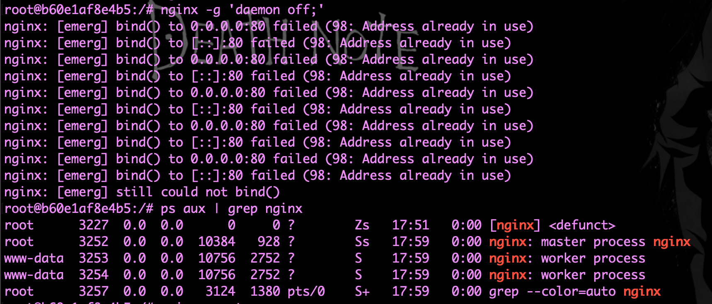
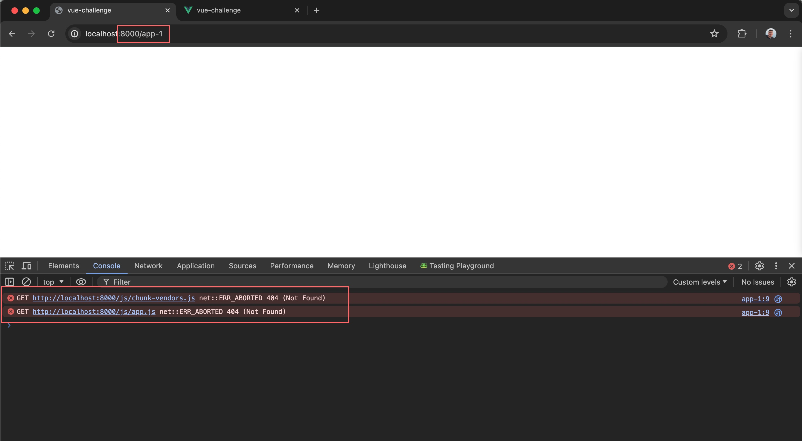

### Установить nginx

Команда:

- `apt update`
- `apt install nginx -y`

### Запустить nginx

Команда:

`nginx`

**Чтобы запустить Nginx в фоне:**

- `nginx -g 'daemon off;' &`
  - `"&"` - позволяет запустить nginx в фоне с возможность дальше использовать консоль для работы

> Запуск NGINX на НЕ 80 порту описано [тут](#что-бы-запустить-nginx-на-другом-порту-можно-изменить-конфигурацию)

### Проверка состояния Nginx

Команда:

`ps aux | grep nginx`

Ответ должен быть примерно такой:

|           |    |     |     |       |             |    |       |                                                 |
| --------- | -- | --- | --- | ----- | ----------- | -- | ----- | ----------------------------------------------- |
| root      | 19 | 0.4 | 0.1 | 10384 | 6668 pts/0  | S  | 15:23 | 0:00 nginx: master process nginx -g daemon off; |
| www-data  | 20 | 0.0 | 0.0 | 10784 | 2716 pts/0  | S  | 15:23 | 0:00 nginx: worker process                      |
| www-data  | 21 | 0.0 | 0.0 | 10784 | 2712 pts/0  | S  | 15:23 | 0:00 nginx: worker process                      |
| root      | 23 | 0.0 | 0.0 | 3124  | 1364 pts/0  | S+ | 15:23 | 0:00 grep --color=auto nginx                    |

> Если в ответе нет строки с колонкой `"S"` ( без "+" ) и `"nginx: master process nginx ..."`
  значит nginx не запущен

### Перезапустить nginx

Команда:

- `nginx -s reload`

> NGINX по умолчанию запускается на порту 80. Если при запуске nginx возникли ошибки, порты заняты - нужно:
- [остановить nginx](#остановаить-nginx) и [запустить nginx заново](#запустить-nginx)
- [Убить все процессы nginx](#убить-все-процессы-nginx) и [запустить nginx заново](#запустить-nginx)
- [Убить сервер на порту, на котором nginx будет запускаться](#убить-порт-по-pid) и [запустить nginx заново](#запустить-nginx)



##### Остановаить nginx

Команда:

`nginx -s stop`

##### Убить все процессы nginx

Команда:

`killall nginx`


### Работа с портом

##### Проверить порт

[Как проверить порт](../02_linux.md#проверить-порт)

#### Убить порт по PID

[Как убить порт по его PID](../02_linux.md#убить-порт-по-pid-1)

---

### Настройка NGINX сервера

##### Отрыть файл с конфигурацией nginx

команда:

`nano /etc/nginx/nginx.conf`

##### Настроить блок сервер

команда:

```
server {
    listen 80;
    server_name localhost;

    location / {
        root /var/www/html;
        index index.html index.htm;
    }
}
```
Как должен выглядить [nginx когфиг](./01_first_nginx_config.conf)

##### Создай директорию для размещения веб-файлов

команда:

`mkdir -p /var/www/html`

##### Создай тестовый файл index.html

команда:

`echo "Hello, Nginx from Docker!" > /var/www/html/index.html`

##### Перезапустить сервер

Как перезапустить сервер описано [тут](#перезапустить-nginx)

---

### Возможные ошибки при запуске

- Проверь наличие файла index.html в директории /var/www/html:
  `ls -l /var/www/html`
  - Если файла нет, создай его:
    `ls -l /var/www/html`
- Проверь разрешения на директорию и файлы:
  `ls -ld /var/www/html`
  `ls -l /var/www/html`
- Убедись, что владелец и группа директории и файлов позволяют доступ Nginx. Обычно директория должна быть доступна для чтения пользователем www-data:
  `chown -R www-data:www-data /var/www/html`
  `chmod -R 755 /var/www/html`
- Убедись, что путь к директории /var/www/html указан правильно в конфигурационном файле Nginx. Открой конфигурационный файл:
  - Если уже есть установленный сайт - `nano /etc/nginx/sites-available/default`
  - Если пользуешься основным конфигом - `nano /etc/nginx/nginx.conf`
  - Убедись, что блок server выглядит следующим образом:
    ```
    server {
      listen 80;
      server_name localhost;

      location / {
          root /var/www/html;
          index index.html index.htm;
      }
    }
    ```
- [Перезапусти Nginx](#перезапустить-nginx)

---

### Что бы запустить Nginx на другом порту, можно изменить конфигурацию:

##### Открой конфигурационный файл Nginx:

Команда:

`nano /etc/nginx/nginx.conf`

##### Измени порт в блоке server {}:

Изменения:

```
  server {
    listen 8080;
    server_name localhost;

    location / {
        root /var/www/html;
        index index.html index.htm;
    }
  }
  ```

[Перезапустить сервер](#перезапустить-nginx)**

После перезапуска Nginx, проверь, что он работает на новом порту.

##### Узнай IP-адрес контейнера:

Команда:

`docker inspect -f '{{range .NetworkSettings.Networks}}{{.IPAddress}}{{end}}' my-ubuntu-container`

**my-ubuntu-container** - Это название контейнера

Описание выполнения команды [тут](../04_docker.md#узнать-ip-адрес-контейнера-с-хостовой-машины)

---

### NGINX как прокси сервер

###### Открыть конфигурационный файл Nginx:

Команда:

`nano /etc/nginx/nginx.conf`

###### Вставить конфиг для проксирования

[Конфиг для проксирования](./02_nginx-proxy-localhost-config.conf)

**Описание "server_name:"**
- **"server_name localhost"** -
  Когда мы указываем server_name localhost;, это означает, что этот серверный блок будет обрабатывать запросы,
  которые направлены на домен localhost. Это полезно для тестирования на локальной машине,
  где вы можете направлять запросы на localhost для получения ответа от Nginx.
- **"server_name _"** -
  Когда мы используем server_name _;, это специальное значение, которое означает,
  что этот серверный блок будет обрабатывать все запросы, для которых нет другого более точного совпадения.
  Это удобно в ситуациях, когда вы хотите, чтобы ваш серверный блок обрабатывал запросы, направленные на любой домен,
  особенно когда вы работаете с проксированием или обратным прокси-сервером.
  ***Стоит учитывать что все конфиги будут конфиктовать если у них одинаковые server_name и прослушиваемые порты***
  [Где проверить и как удалить дубли](#удаление-дублирующих-конфигураций)

Например, если у тебя есть файл default в /etc/nginx/sites-enabled/, который также прослушивает порт 80 и использует server_name _;, можешь временно отключить его, переименовав:

> Вместо обращения к ip адреса контейнера можно обращаться к ip ( `proxy_pass http://<IP-хоста>:8081;`, где
  IP-хоста может быть 0.0.0.0 ) хостовой машины, если сервер крутится на этой же машине.
  Но использование 0.0.0.0 не является правильным способом.
  0.0.0.0 обозначает все интерфейсы, и это не конкретный IP-адрес, к которому можно обратиться.
  Вместо этого, лучше использовать конкретный IP-адрес хостовой машины или специальное DNS-имя,
  предоставляемое Docker ( `http://host.docker.internal` ).

> Docker предоставляет специальное DNS-имя для обращения к хосту из контейнера - host.docker.internal.
  Это имя будет резолвиться в IP-адрес хостовой машины. Это работает в Docker для Mac и Windows,
  а также в некоторых Linux-дистрибутивах с поддержкой Docker.

**Описание аттрибутов:**
1. **proxy_set_header Host $host;:**
  Передает заголовок Host от оригинального запроса к проксируемому серверу.
2. **proxy_set_header X-Real-IP $remote_addr;:**
  Передает оригинальный IP-адрес клиента к проксируемому серверу.
3. **proxy_set_header X-Forwarded-For $proxy_add_x_forwarded_for;:**
  Передает цепочку IP-адресов через заголовок X-Forwarded-For, добавляя IP-адрес клиента.
4. **proxy_set_header X-Forwarded-Proto $scheme;:**
  Передает схему (http или https) от оригинального запроса.

**Переменные указанные в конфиге**
1. **$host:**
  Содержит имя хоста, на который был отправлен запрос. Обычно это значение из заголовка Host HTTP-запроса.
  Если заголовок Host отсутствует, переменная содержит имя сервера, указанное в директиве server_name.
2. **$remote_addr:**
  Содержит IP-адрес клиента, который сделал запрос к Nginx.
  Это IP-адрес конечного пользователя, который отправил запрос.
3. **$proxy_add_x_forwarded_for:**
  Содержит значение заголовка X-Forwarded-For входящего запроса, а также IP-адрес клиента. Если заголовок X-Forwarded-For уже существует, он добавляет к нему IP-адрес клиента. Эта переменная используется для передачи оригинального IP-адреса клиента через цепочку прокси-серверов.
4. **$scheme:**
  Содержит схему запроса, используемую для доступа к серверу. Значение может быть http или https, в зависимости от того, какой протокол используется.

###### Удаление дублирующих конфигураций

Если ты используешь стандартную конфигурацию Nginx, может быть другой файл с конфликтующим **"server_name _;"**.
Убедись, что файлы в следующих папках не содержат дублирующие конфигурации:

- `/etc/nginx/conf.d/`
- `/etc/nginx/sites-enabled/`

Например, если у тебя есть файл `default` в `/etc/nginx/sites-enabled/`, который также прослушивает порт 80 и
использует `server_name _;`

Варианты устранения:
- можно временно отключить его, переименовав:
  `mv /etc/nginx/sites-enabled/default /etc/nginx/sites-enabled/default.backup`
- но чаще всего, в стандартный конфиг NGINX импортируется все файлы из `/etc/nginx/sites-enabled` и по этому файл
  с расширением `.backup` все равно попадет в конфиг. Можно временно законмментировать строчку с импортом:
  [Файл с конфигом в котором закоментирована строка с импортом](./04_comment_include-sites-enabled.conf)


[После перезагрузи сервер](#перезапустить-nginx)

###### Проксирование для приложений в которых есть собственные роуты

[Конфиг для проксирования](./03_app_own_routes_nginx_proxy_config.conf)

**Объяснение "rewrite"**
- "rewrite ^/app-1(/.*)$ $1 break;" - Эта директива переписывает путь запроса,
  удаляя префикс /app-1 перед отправкой на проксируемый сервер.
  Например, запрос `http://host_server_name/app-1/about` будет переписан как /about при проксировании на сервер app-1.

> Nginx будет проксировать запросы с пути /app-1 на сервер, запущенный на порту 8081.
  В конфигурационном файле nginx.conf мы указали proxy_pass `http://host.docker.internal:8080`, что означает,
  что запросы будут перенаправляться на IP-адрес хостовой машины и порт 8081.

###### Проксирование статичных файлов

После всех манипуляций, NGINX все равно будет криво работать со статичными файлами.



Что бы корректно подгружать статичные файлы нужно подменять url.
[Корректный конфиг](./05_correct_static-file-loading.conf)

**Объяснение "sub_filter"**
- **"sub_filter 'href="/' 'href="/app-1/'"** и **"sub_filter 'src="/' 'src="/app-1/'"**:
  Подстановка путей для корректной загрузки ресурсов. Это гарантирует,
  что все пути, начинающиеся с `/`, заменяются на `/app-1/`.
 
> Т.е. все пути, которые проксируемое приложение будет вызывать внутри себя, в итоге будут изменены на `/app-1/...`
> Если дефолтное обращение приложения к какому нибудь статичному файлу - это `http://localhost:8080/js/chunk-vendors.js`
> То наш сервер будет менять их на `http://localhost:8000/app-1/js/chunk-vendors.js`.
> А вот уже rewrite снова будет их выпиливать что бы само проксируемое приложение понимало от куда грузить файлы.
> Т.е. для него это снова будет `http://localhost:8080/js/chunk-vendors.js`


