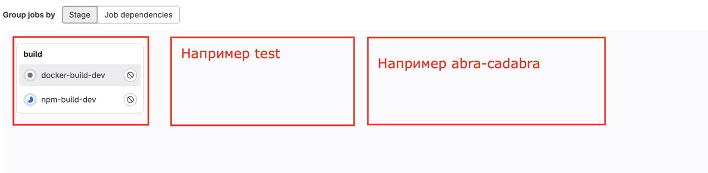

##### Используем "double quotes" для переменных?
- "$VAR" → сохраняет пробелы, специальные символы.
- $VAR → может сломаться, если VAR="some value with spaces".

```shell
VAR="hello world"
echo "$VAR"   # → Работает: "hello world"
echo $VAR     # → Ошибка: echo считает второе слово отдельным аргументом
```

##### GitLab Runner использует docker:dind, а он на Alpine.

- В Alpine нет `apt-get`, а есть `apk`.

**Как проверить?**

```shell
docker run --rm -it docker:dind sh
apk update && apk add openssh-client
```

##### Как использовать sudo в GitLab CI/CD?

> GitLab CI/CD не вводит пароль вручную, поэтому нужно разрешить пользователю {username} использовать `sudo`
> без пароля на wps сервере.

- Проверь текущие sudo-права:
  - ```shell
      sudo cat /etc/sudoers
    ```
- Добавь пользователя {username} в sudoers без пароля:
  - ```shell
        echo "{username} ALL=(ALL) NOPASSWD:ALL" | sudo tee -a /etc/sudoers
    ```
- После этого в GitLab CI/CD можно писать просто `sudo docker` без ввода пароля.


##### stages

- Можно указывать разные stages и это будут отдельные блоки в ui пайплайнов
  - 

- Очередность указывается в ключе stage
  - ```yaml
    stages:
      - npm
      - build
      - test
      - lint
      - deploy
    ```
  - При чем GitLab не требует, чтобы каждый пайплайн выполнял все stages из списка, но порядок выполнения он всё равно соблюдает.
  - Например для `dev` ветки у вас есть джобы для стадий `npm`, `build`, `test` и `lint`, а для `main` ветки `npm`, `build`, `deploy` - 
  все нормально, Gitlab считает последовательность и просто пропустит стадии если для них нет джоб


